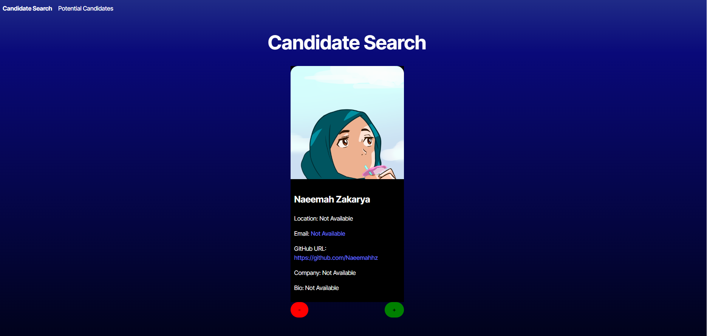

# Candidate Search

## Description

Web Application allowing users to search potential employees via GitHub's userbase.

## Table of Contents

- [Installation](#installation)
- [Usage](#usage)
- [Questions](#questions)
- [License](#license)

## Installation

No installation required. Application is deployed on Render.

## Usage

A random Github user will appear. If you like them, click on the green plus button. If you do not like them, click on the red minus button. Either button will generate a new Github user. The plus button will save the user to your list of Potential Candidates. Click on the Potential Candidates link to view your selected candidates. You can view them in a table and remove any candidates with the Reject button.

## Contributing 

## Questions

Here is a link to my Github Profile: <a href="https://github.com/sketchyTK">Sketchy TK</a>

## License
Please View https://opensource.org/licenses/gpl-3.0 for more information on this license.

## Live Deployment

<a href="https://candidate-search-1-ub22.onrender.com/">Live Deployment on Render</a>